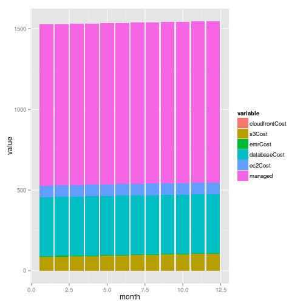
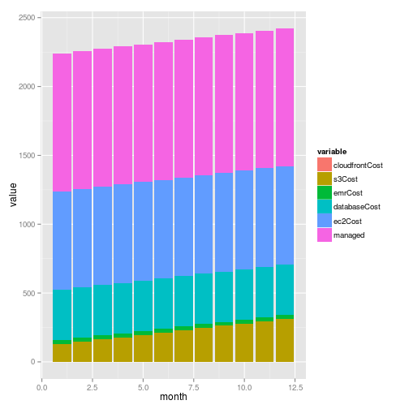

# Example calculation

This example uses Snowplow TCO Model and Knitr to produce a report on costs for some present and future workload. 

To run in you need the knitr package installed:

```r
install.packages("knitr")
library(knitr)
knit2html("example.Rmd")
```


```r
library("reshape")
library("ggplot2")
```

## Cost for a current workload

Assume:
 
- 10,000,000 events per month
- 1,000,000 users 
- 1 run per day 
- data stored in Redshift
- 12 months
- Using Clojure collector on EC2 rather than Cloudfront collector


```r
costModelNow <- snowplowCostByMonth(1e+06, 1e+07, 1, "redshift", 12, 10000, 
    "clojure")
round(costModelNow)
```

```
##    month cloudfrontCost s3Cost emrCost databaseCost ec2Cost managed
## 1      1              0     86       4          365      72    1000
## 2      2              0     88       4          365      72    1000
## 3      3              0     89       4          365      72    1000
## 4      4              0     91       4          365      72    1000
## 5      5              0     93       4          365      72    1000
## 6      6              0     95       4          365      72    1000
## 7      7              0     97       4          365      72    1000
## 8      8              0     99       4          365      72    1000
## 9      9              0    101       4          365      72    1000
## 10    10              0    102       4          365      72    1000
## 11    11              0    104       4          365      72    1000
## 12    12              0    106       4          365      72    1000
##    totalCost
## 1       1527
## 2       1529
## 3       1531
## 4       1533
## 5       1535
## 6       1536
## 7       1538
## 8       1540
## 9       1542
## 10      1544
## 11      1546
## 12      1548
```

```r
sum(costModelNow$totalCost)
```

```
## [1] 18448.7
```

```r
costs <- costModelNow[c(1:7)]
costs <- melt(costs, id = "month")
p <- ggplot(costs, aes(x = month, y = value, fill = variable))
p <- p + geom_bar(stat = "identity")
p
```

 

## Cost for a future workload

Assume:

- 100,000,000 events per month
- 10,000,000 users
- 1 run per day
- data stored in Redshift
- 12 months
- Using Clojure collector on EC2 rather than Cloudfront collector


```r
costModelFuture <- snowplowCostByMonth(10000000, 100000000, 1, 'redshift', 12, 10000, 'clojure')
round(costModelFuture)
```

```
##    month cloudfrontCost s3Cost emrCost databaseCost ec2Cost managed
## 1      1              0    129      29          365     716    1000
## 2      2              0    146      29          365     716    1000
## 3      3              0    162      29          365     716    1000
## 4      4              0    179      29          365     716    1000
## 5      5              0    196      29          365     716    1000
## 6      6              0    212      29          365     716    1000
## 7      7              0    229      29          365     716    1000
## 8      8              0    245      29          365     716    1000
## 9      9              0    262      29          365     716    1000
## 10    10              0    279      29          365     716    1000
## 11    11              0    295      29          365     716    1000
## 12    12              0    312      29          365     716    1000
##    totalCost
## 1       2240
## 2       2256
## 3       2273
## 4       2290
## 5       2306
## 6       2323
## 7       2339
## 8       2356
## 9       2373
## 10      2389
## 11      2406
## 12      2422
```

```r
sum(costModelFuture$totalCost)
```

```
## [1] 27973.21
```

```r
costs <- costModelFuture[c(1:7)] 
costs <- melt(costs, id="month")
p <- ggplot(costs, aes(x=month, y=value, fill=variable))
p <- p + geom_bar(stat="identity")
p
```

 


